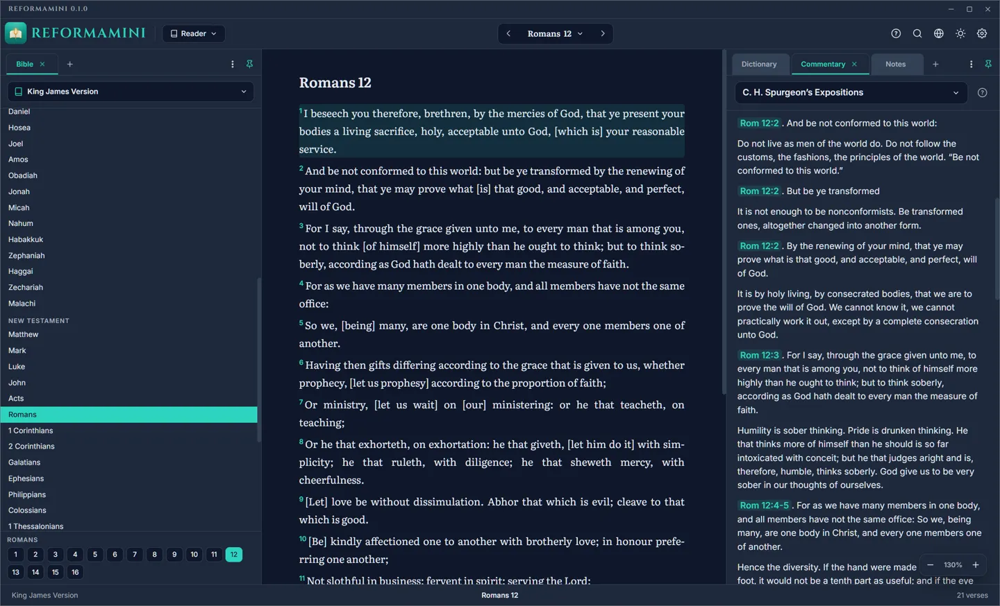
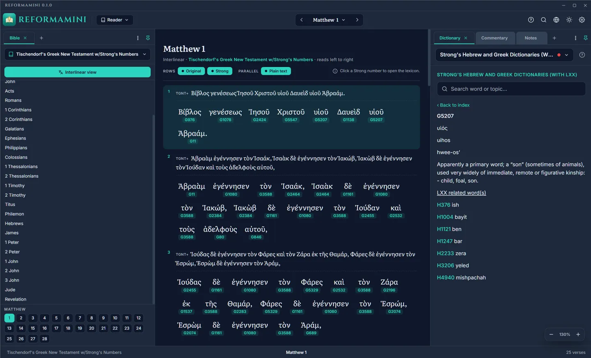
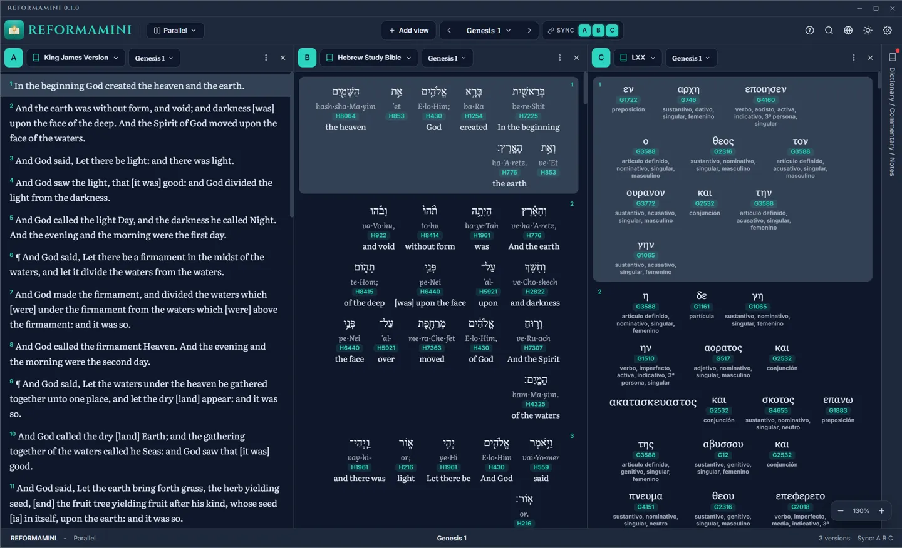
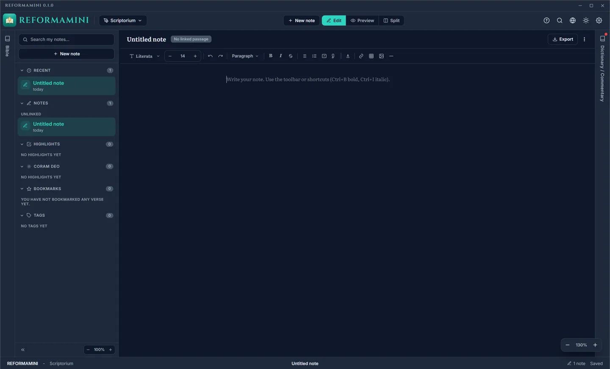
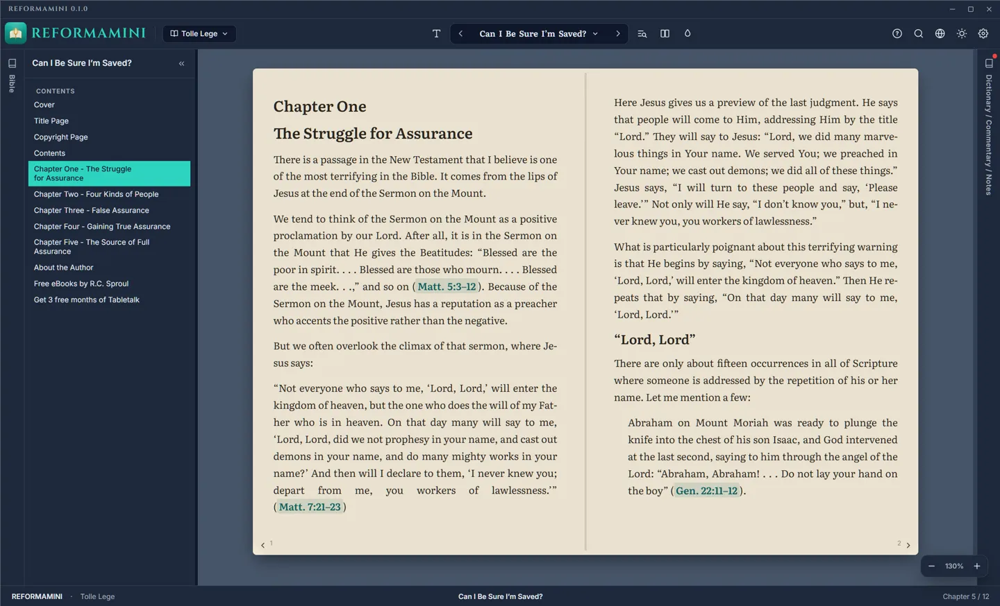
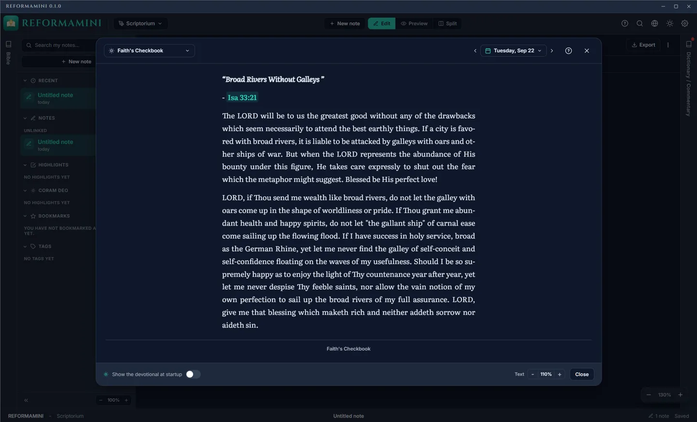

  

# REFORMAMINI

A modern, lightweight, offline-first desktop app for **anyone who wants to study the Word of God**. It reads legacy **e-Sword modules** natively, turns Scripture citations into clickable links (including inside your own PDFs and EPUBs), renders Greek and Hebrew interlinear text with Strong's numbers and readable morphology, keeps your notes as plain Markdown files on disk, and wraps it all in a clean, distraction-free interface in **English and Spanish**.

> *«And do not be conformed to this world, but be transformed by the renewing of your mind, so that you may approve what the will of God is, that which is good and pleasing and perfect.»*
> Romans 12:2 (LSB)
>
> The name comes from the Latin Vulgate of that verse: *sed reformamini in novitate sensus vestri*. That renewal comes from studying the Word.

---

## ⬇️ Download

**REFORMAMINI 0.1.0 is a beta.** It is ready for daily use, but a rare module may not read quite right. Get it from the [latest release](https://github.com/REFORMAMINI/REFORMAMINI/releases/latest):

- **Windows · installer** — Windows 10 or later, with the interface engine included.
- **Windows · portable** — a folder to carry on a USB drive, with your data kept inside it.
- **Linux · AppImage** — a single file for Debian, Ubuntu, Arch and Fedora.

Each download is accompanied by its **SHA-256 fingerprint** and the release notes. Updates are signed and you decide when to install them.

## 🪟 A note about the Windows warning

When you open the installer, Windows may show a blue box saying **"Windows protected your PC"**. This is normal for a new program that does not yet carry a paid commercial signing certificate. **It does not mean the file is a virus, and you do not need to disable any protection.** To continue, click **"More info"** and then **"Run anyway"**. If you want to be sure the file is the one we published, compare its SHA-256 fingerprint with the one shown next to the download.

## 🐞 Report a problem

This beta is meant to be tested with real modules and real study. If something does not work as you expect, please open an **issue**:

- **Bugs and suggestions:** [github.com/REFORMAMINI/REFORMAMINI/issues](https://github.com/REFORMAMINI/REFORMAMINI/issues)

When you report a problem, tell us which version of REFORMAMINI you use, whether you are on Windows or Linux, which module you were reading, the exact steps to reproduce it and what you expected to happen. The more precise the report, the faster it can be fixed.

---

## 🎯 The Mission

REFORMAMINI is built to **democratize systematic Bible study for everyone**. Whether you are a beginner or a dedicated student of the Word, REFORMAMINI provides advanced tools (original language parsing, concordances, and multi-version comparison) wrapped in a minimal, highly accessible interface. It includes an offline-first **Learning Center** designed to guide users through the basics of hermeneutics and language tools in plain, accessible language.

---

## 📷 Screenshots

### 📖 Bible Reader & Commentary Interface

### 🏛️ Original Languages & Interlinear View

### 📚 Parallel Bible Versions (Side-by-Side Comparison)

### ✍️ Your Own Notes (Scriptorium)

### 📖 Document Viewer (Tolle lege)

### 🕊️ Devotional Study (Coram Deo)

---

## ⚙️ What REFORMAMINI does today

Every feature listed here is built and working in the app.

### Reading and study

* 📚 **Native e-Sword support, both generations.** Reads community-contributed SQLite modules directly, in the classic format and in the recent `i` generation: Bibles (`.bblx`, `.bbli`), commentaries (`.cmtx`, `.cmti`), dictionaries and lexicons (`.dctx`, `.dcti`, `.lexx`, `.lexi`), devotionals (`.devx`, `.devi`), maps (`.mapx`) and reference books (`.refx`, `.refi`, `.topx`, `.topi`). The newer generation stores markup of its own rather than RTF, including Strong's numbers, red-letter words of Jesus and original-language runs, and all of it is translated rather than stripped. Encrypted modules are detected and reported clearly, never decrypted.
* 🪟 **Dockable panel workspace.** Commentary, dictionary, notes and Bible panels are tabs you can drag to any edge, pin, reorder or fold into a side rail. Global interface zoom included.
* 📊 **Parallel view.** Two to four versions side by side with verse-synchronized scrolling.
* 🏛️ **Interlinear view.** Word to original to Strong's number to morphology, rendered from the tagged text rather than dumped HTML, with hover tooltips that expand morphology codes into plain language. Where a module marks them, the same tooltip says how that word is transmitted across editions of the original text, and how each edition spells it.
* 🔗 **Bilingual reference engine.** Detects Scripture citations in English and Spanish across commentaries, notes, books, PDFs and EPUBs. Click opens the passage; hover shows a preview in the Bible version you choose.
* 🕊️ **Coram Deo.** A dedicated reader for e-Sword devotional modules, by month and day.
* 🌍 **Atlas.** Maps, charts and timelines extracted from map modules, with zoom, pan and section navigation.

### Your own material

* 📖 **Tolle lege.** A unified book reader for e-Sword reference books, **PDF** files (rendered with PDF.js in a two-page book frame) and **EPUB** files (reflowable, paginated on the fly, with a navigable table of contents). Scripture citations inside all three are clickable and drive the Bible panel.
* 📝 **Scriptorium.** Notes are plain **Markdown files on disk**, one per note, with a native editor, tags, and an optional link to a passage. Nothing is locked inside a database you cannot read.
* 🖍️ **Highlights and bookmarks.** Six highlight colors with a selection popup, per-verse annotations, and collections gathered by book. Highlights work in the Bible, in books, in PDFs and in EPUBs.
* 🔍 **A global search that forgives.** Full-text search (SQLite FTS5) across Bibles, commentaries, dictionaries, books **and your own notes**, with a background index that rebuilds as your library grows. Quote a verse from memory and it still finds it: if no result matches every word, the closest verses come back clearly marked as approximate. It counts how many times a word appears, verse by verse and book by book, and it reads Greek and Hebrew the way people actually type them, with or without accents and vowel points. Filter by language, and look a word up by its Strong's number to land on its lexicon entry.

### Getting started and staying oriented

* 🚀 **First-run assistant.** A six-step wizard that opens in your system language, lets you pick the interface language, theme and library folder, and imports your modules by drag and drop.
* 📘 **User manual.** The installer and the portable folder ship a bilingual user manual (Word, with screenshots, and a plain-text copy) that covers every screen and control. How to study the Bible lives in the in-app Study Guide, not in that file.
* 📦 **Batteries included.** Ships with the King James Version, the Reina-Valera 1909 and twenty historic creeds and confessions of the church, in English and Spanish, so the app is useful before you import anything.
* 🎓 **Learning Center.** An offline wiki-style guide (glossary, historical-grammatical method, study pedagogy), a first-visit introduction for every screen, and guided tours, all written in plain language and available in both languages.
* 🎨 **Appearance and reading settings.** Four themes (Light, Midnight, Cream, Azure), a custom accent color that adapts to each theme, reading typography (a choice of seven bundled reading faces, plus size, line spacing, column width and justification), and red letters for the words of Jesus. The parallel view keeps a face per column, and the document viewer keeps its own.
* 📁 **A library folder you can see.** Your modules and notes live in a visible folder (`Documents/REFORMAMINI` by default, changeable), so backing up or syncing them is your call.
* 🔄 **Signed updates on your terms.** REFORMAMINI can check for a new version (on startup if you turn it on, or whenever you press "Check now"), download it in the background and tell you when it is ready; you decide when to restart. The check is off by default, and it is the only thing that ever uses the network.

### Principles

* 🛡️ **Absolute privacy, offline-first.** REFORMAMINI collects nothing, stores nothing on anyone else's servers and sends nothing anywhere. There is no telemetry, no analytics, no user identifier, no advertising and no account. Your notes, highlights and modules live only on your computer. The one network use is the opt-in update check, which can be turned off.
* 🔒 **Your modules are never modified.** They are opened strictly read-only; your notes and highlights are stored separately.
* ⚡ **Low footprint.** Built on Tauri 2 (Rust) and SvelteKit so it runs on older or donated hardware.

---

## ⏳ On the roadmap

REFORMAMINI is in active development toward version 1.0. What is still ahead:

* 🏷️ **Your own tags on highlights:** gather what you underlined in Romans, Ephesians and Titus under one theme.
* 📤 **Document exporting:** notes already export to Markdown; formatted PDF export of passages and study notes is planned.
* 🌐 **Translation, OCR and audio:** exploratory, after 1.0.

---

## 💻 What you need

* **Windows** 10 or later, or **Linux**
* No account, no registration, no internet connection required
* It runs on older and donated hardware, which is a design goal and not an afterthought

---

## ⚖️ License

REFORMAMINI is **free software in the plain sense of the word: it costs nothing**. It is not open source.

You may install it on as many computers as you like, for personal, family, devotional, academic, congregational or professional use, forever, without paying anything and without creating an account.

You may also **pass it on**: copy the installer to a USB drive, hand it to a friend or to your congregation, install it on someone else's computer. The only conditions are that you pass it on unmodified, that you charge nothing for it, and that the use agreement travels with it.

You may not sell it, charge for it, bundle it into a paid product, or modify it.

The full terms are in [`LICENSE`](LICENSE), in English and Spanish. You can also read them inside the app, under Settings, About.

**What REFORMAMINI does not own.** The two bundled Bibles are in the public domain and you may extract and reuse them freely. Some of the bundled historic creeds and confessions are reproduced in modern translations whose rights belong to their translators and publishers; the use agreement grants no rights over those. Each text states its own source and rights inside the app.

The name and logo "REFORMAMINI" are reserved and are not licensed with the app.

"e-Sword" is a trademark of its respective owner. REFORMAMINI reads modules in the format that program uses, but is not affiliated with it, does not carry its endorsement or sponsorship, and does not include or use its code.

---

## ❤️ Support the project

REFORMAMINI is free, **forever**. There are no paid tiers and no locked features. If REFORMAMINI is useful to you and you want to support its development, please consider making a voluntary donation. Your contribution will help maintain the project and keep improving the app for the study of God's Word for everyone.

A donation is voluntary and unlocks nothing: no feature, no content and no advantage. The app stays the same for everyone.

**[Make a voluntary donation](https://ko-fi.com/reformamini)** · [reformamini.com](https://reformamini.com)

> «But grow in the grace and knowledge of our Lord and Savior Jesus Christ. To Him be the glory, both now and to the day of eternity. Amen.» · 2 Peter 3:18 (LSB)

---

**SOLI DEO GLORIA**
